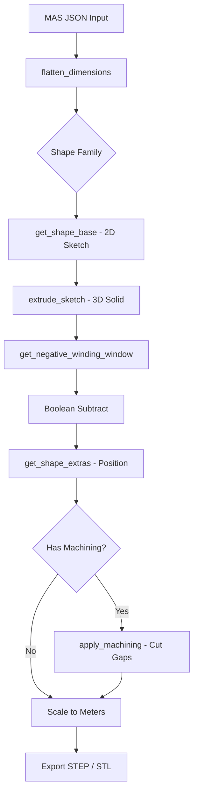
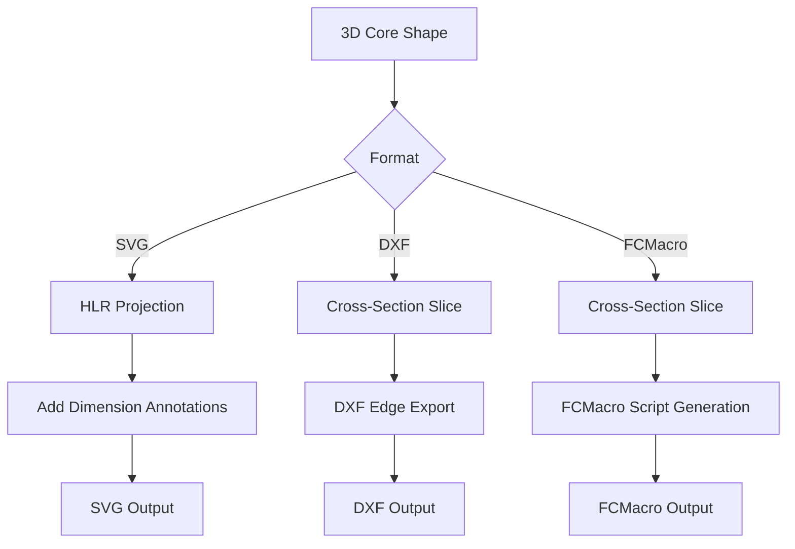
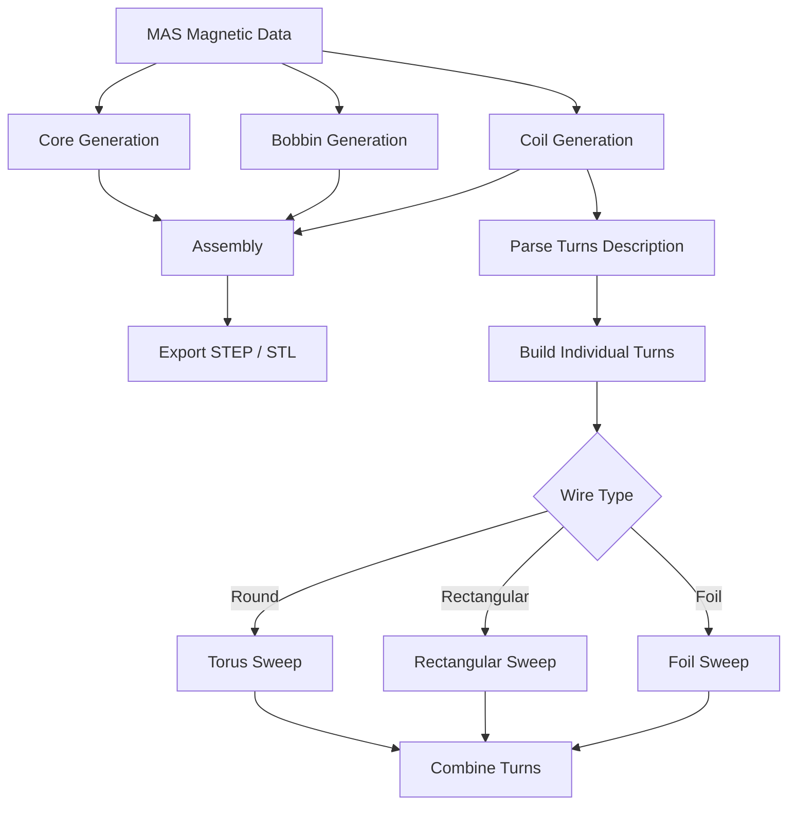

# Data Flow

## Core Generation Pipeline



## Dimension Flattening

MAS dimensions can be specified in three ways:

```json
// Plain number
"A": 0.042

// Nominal value
"A": {"nominal": 0.042}

// Min/max range (nominal is computed as average)
"A": {"minimum": 0.041, "maximum": 0.043}
```

The `flatten_dimensions()` function resolves all formats to a single numeric value:

```python
from OpenMagneticsVirtualBuilder.utils import flatten_dimensions

data = {
    "dimensions": {
        "A": {"minimum": 0.041, "maximum": 0.043},
        "B": {"nominal": 0.021},
        "C": 0.017
    }
}

flat = flatten_dimensions(data, scale_factor=1000)
# {"A": 42.0, "B": 21.0, "C": 17.0}  (converted to mm)
```

## Gapping / Machining

Core gaps are specified as machining operations in the geometrical description:

```json
{
    "machining": [
        {
            "type": "subtractive",
            "length": 0.0005,
            "coordinates": [0, 0, 0]
        }
    ]
}
```

The `apply_machining()` method creates a tool solid and performs a boolean subtraction from the core piece.

- **coordinates[0] == 0**: Center-leg gap (uses column width `F`)
- **coordinates[0] != 0**: Lateral-leg gap (uses half of `A`)

## Technical Drawing Pipeline



### SVG Generation

1. Shape is projected using OCC hidden-line removal (HLR)
2. Visible and hidden edges are separated
3. Dimension annotations are computed from shape bounding box
4. SVG markup is assembled with projection lines and labels

### DXF Generation

1. Shape is sliced at the principal plane (XY, XZ, or ZY)
2. Cross-section edges are extracted
3. Edges are written to DXF format via `ezdxf`

## Complete Magnetic Pipeline



### Turn Hierarchy

1. **Turn**: Single wire loop around the core column
2. **Layer**: Multiple turns stacked vertically
3. **Section**: Multiple layers stacked radially
4. **Winding**: Complete winding (primary, secondary, etc.)
5. **Coil**: All windings combined
6. **Magnetic**: Core + bobbin + coil assembly
