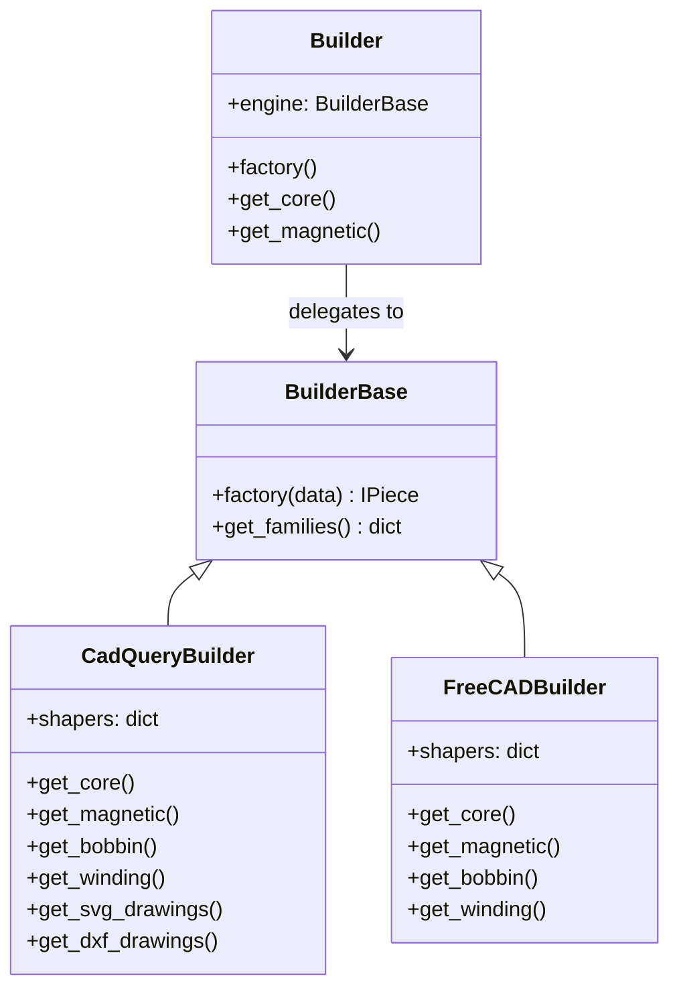

# CAD Engines

MVB implements the **Strategy pattern** with two interchangeable rendering engines.

## Engine Comparison

| Feature | CadQuery | FreeCAD |
|---------|----------|---------|
| System install required | No | Yes |
| CI / headless support | Yes | Limited |
| 3D export (STEP, STL) | Yes | Yes |
| OBJ export | No | Yes |
| SVG drawings | Yes | Yes |
| DXF drawings | Yes | No |
| FCMacro sketches | Yes | Yes |
| Technical drawings with dimensions | Yes | Yes |
| Performance | Fast | Moderate |

## When to Use Which

### CadQuery (Default)

Choose CadQuery when:

- Running in CI/CD pipelines or Docker containers
- No FreeCAD installation available
- Cross-platform compatibility required
- You need DXF output

```python
builder = Builder("CadQuery")
```

### FreeCAD

Choose FreeCAD when:

- FreeCAD is already installed
- You need OBJ mesh export
- You need FreeCAD-native project files (`.FCStd`)

```python
builder = Builder("FreeCAD")
```

## Engine Architecture



## FreeCAD Path Discovery

The FreeCAD engine searches standard installation paths:

=== "Linux"

    1. `/usr/lib/freecad/lib`
    2. `/usr/lib/freecad-daily/lib`

=== "Windows"

    1. `%LOCALAPPDATA%\Programs\FreeCAD 1.0\bin`
    2. `%LOCALAPPDATA%\Programs\FreeCAD 0.21\bin`
    3. `%ProgramFiles%\FreeCAD 1.0\bin`

## Tessellation Quality

The CadQuery engine supports configurable tessellation quality for STL export:

```python
from OpenMagneticsVirtualBuilder.cadquery_builder import set_tessellation_quality

# Coarse quality for fast previews
set_tessellation_quality(segments_per_circle=12)

# High quality for final renders
set_tessellation_quality(segments_per_circle=48, linear_tolerance=0.01)
```

| Preset | Segments | Use Case |
|--------|----------|----------|
| Coarse | 8-12 | Quick previews |
| Medium (default) | 16-24 | Balanced quality |
| High | 32-48 | Smooth curves |
| Ultra | 64+ | Final renders |
