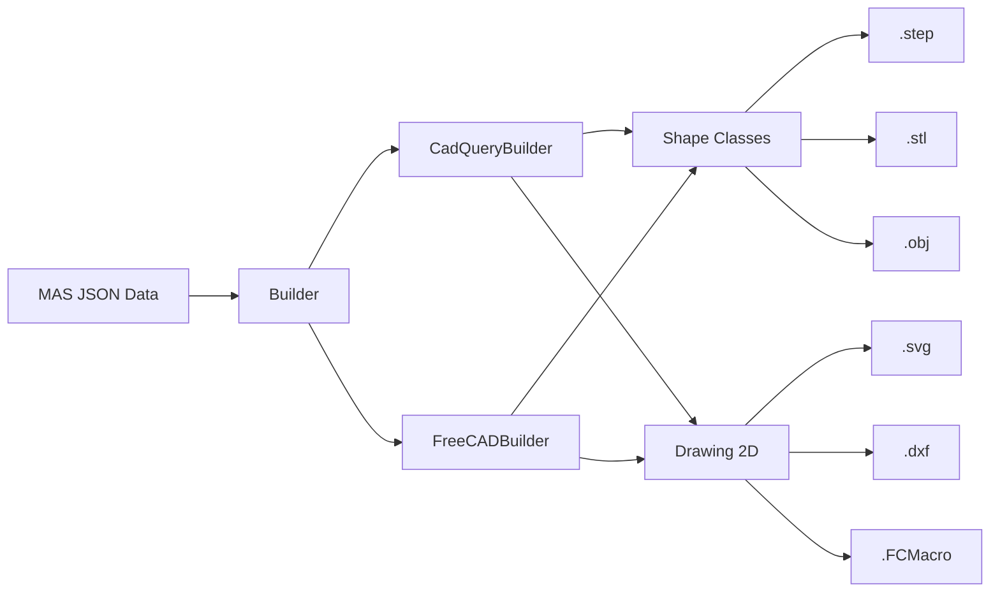

# Architecture Overview

## High-Level Block Diagram



## Component Table

| Component | File | Responsibility |
|-----------|------|----------------|
| **Builder** | `builder.py` | Main API facade, engine selection |
| **CadQueryBuilder** | `cadquery_builder.py` | CadQuery rendering engine (~3800 lines) |
| **FreeCADBuilder** | `freecad_builder.py` | FreeCAD rendering engine (~3800 lines) |
| **Drawing 2D** | `drawing_2d.py` | Multi-format 2D technical drawings |
| **Utils** | `utils.py` | ShapeFamily enum, dimension helpers |
| **Shape Configs** | `shape_configs.py` | Shared dimension/subtype tables |
| **Magnetic Builder** | `magnetic_builder.py` | Backward-compatibility wrapper |

## Design Patterns

### Strategy Pattern (Engine Selection)

The `Builder` class acts as a facade. At construction time it instantiates either `CadQueryBuilder` or `FreeCADBuilder`, then delegates every method call to the chosen engine:

```python
builder = Builder("CadQuery")   # picks CadQueryBuilder
builder = Builder("FreeCAD")    # picks FreeCADBuilder
```

Both engines inherit from `BuilderBase` and expose identical public APIs.

### Template Method (Shape Generation)

Each engine contains ~20 nested shape classes that inherit from `IPiece`.
The base class defines the generation pipeline:

1. `get_shape_base()` - create the 2D sketch (abstract)
2. `extrude_sketch()` - extrude to 3D
3. `get_negative_winding_window()` - subtract winding window (abstract)
4. `get_shape_extras()` - translate/transform
5. `apply_machining()` - apply gaps

Concrete shape classes (E, PQ, T, etc.) override the abstract methods.

## Coordinate System

### Concentric Cores (E, PQ, RM, etc.)

| Axis | Direction | MAS Mapping |
|------|-----------|-------------|
| X | Core depth (perpendicular to winding window) | - |
| Y | Core width (radial distance from central column) | `coordinates[0]` |
| Z | Core height (along core axis, vertical) | `coordinates[1]` |

### Toroidal Cores

| Axis | Direction | MAS Mapping |
|------|-----------|-------------|
| X | Radial direction | `coordinates[0]` (distance) |
| Y | Core axis (toroid revolves around Y) | - |
| Z | Tangential direction | - |

## Units

- **Input**: All MAS values are in **meters**
- **Internal**: Geometry is built in **millimeters** for numerical precision
- **Output**: Scaled back to **meters** before STEP/STL export (factor 1000)
