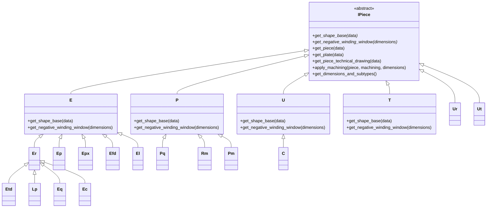

# Shape Class Hierarchy

## Class Inheritance

Each engine contains nested shape classes that implement specific core geometries. The class hierarchy follows the EN 60205 standard grouping:



## Shape Families and EN 60205 Naming

| Class | Family | EN 60205 Name | Base Class |
|-------|--------|---------------|------------|
| `E` | E | E cores | `IPiece` |
| `Etd` | ETD | E cores, round center leg | `Er` |
| `Er` | ER | E cores, round center leg | `E` |
| `Ep` | EP | E cores, pot-like | `E` |
| `Epx` | EPX | E cores, pot-like extended | `E` |
| `Efd` | EFD | E cores, flat design | `E` |
| `Ec` | EC | E cores, cylindrical | `Er` |
| `Eq` | EQ | E cores, square | `Er` |
| `El` | EL | E cores, low profile | `E` |
| `Lp` | LP | Low-profile planar | `Er` |
| `P` | P | Pot cores | `IPiece` |
| `Pq` | PQ | Pot cores, quasi-planar | `P` |
| `Pm` | PM | Pot cores, modified | `P` |
| `Rm` | RM | Pot cores, rectangular | `P` |
| `U` | U | U cores | `IPiece` |
| `Ur` | UR | U cores, round | `IPiece` |
| `Ut` | UT | U cores, T-shape | `IPiece` |
| `C` | C | Cut C-cores | `U` |
| `T` | T | Toroidal cores | `IPiece` |

## Dimension Naming Convention

All shapes use single-letter dimension names from EN 60205:

| Dimension | Meaning |
|-----------|---------|
| **A** | Overall width (largest horizontal dimension) |
| **B** | Overall height of one half |
| **C** | Winding window height |
| **D** | Center leg height (below winding window) |
| **E** | Center leg width or outer leg spacing |
| **F** | Center leg depth / diameter |
| **G** | Additional dimension (shape-specific) |
| **H** | Additional dimension (shape-specific) |
| **J** | Additional dimension (RM family) |

## Subtypes

Some shape families have multiple subtypes (1-4), each with different dimension sets:

```python
# P family has 4 subtypes
P_DIMENSIONS_AND_SUBTYPES = {
    1: ["A", "B", "C", "D", "E", "F", "G", "H"],
    2: ["A", "B", "C", "D", "E", "F", "G", "H"],
    3: ["A", "B", "D", "E", "F", "G", "H"],
    4: ["A", "B", "C", "D", "E", "F", "G", "H"],
}

# RM family has 4 subtypes
RM_DIMENSIONS_AND_SUBTYPES = {
    1: ["A", "B", "C", "D", "E", "F", "G", "H", "J"],
    ...
}
```
